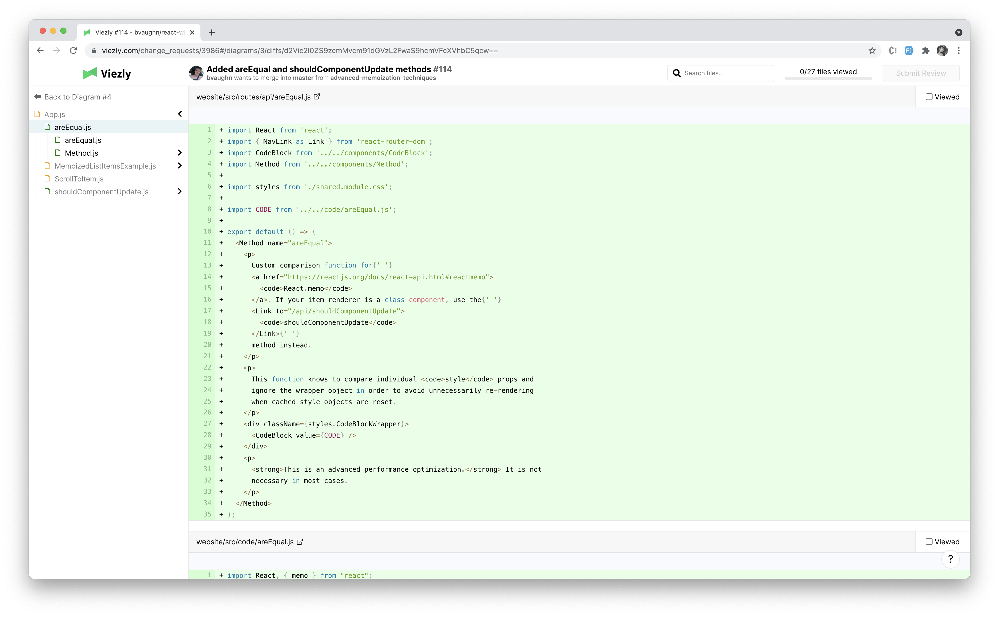
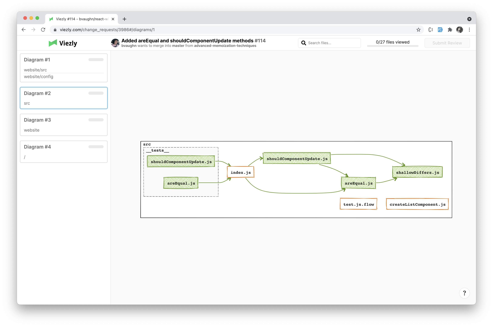

# Usage

Viezly offers a review interface that is based on dependencies between files. You can start your review from entry points and do a review for a big pull request in parts.

## Diagram

After the [installation](/installation#installation), for every pull request, Viezly generates a link to a review interface.  
And the first thing you can see in it is a diagram:

    *[Here is a link](https://viezly.com/change_requests/3986#/diagrams/3) to the example described further in this documentation.*

The diagram shows folders with files and dependencies between files. More details about the notation you can [read here](/elements#elements). Dependencies between files allow you to see the entry point in this pull request and start your review from it.

In this pull request, you can see several not-interdependent files and `App.js` file with 4 dependencies. So the best way to start a review is to see the diff of `App.js`. To do that click on this file on the diagram:

## File diff

Click on a file opens a Git diff for this file:

And besides the clicked file's diff, the Viezly shows diffs of dependent files and diffs of [tied files](elements#the-file-with-tied-files). You can see the list of them in the left side-menu.   
Check it yourself [here](https://viezly.com/change_requests/3986#/diagrams/3/diffs/d2Vic2l0ZS9zcmMvQXBwLmpz) to observe that in real life.

To dig further into dependencies you can click on the arrow near the file name in the side-menu. That arrow opens a diff of the selected file as a "main" file with diffs of its dependencies listed below.

Let say we want to see the dependencies of the `areEqual.js` file. Click the arrow to open its diff.

Here you can see the diff of `areEqual.js` with diffs of its dependencies.

To go back to the initial `App.js` file click on the arrow near its name.

## Split diagram

If the pull request contains more than 15 blocks on a single diagram, Viezly splits the pull request into several smaller diagrams. These diagrams are not interconnected, meaning that **all** dependencies of the files in the diagram are located on this diagram. Viezly tries to merge files located in nearby folders in the single diagrams.

Diagram navigation is located on the left side of the interface:

Here you can see the list of all diagrams for this pull request. Every item contains a shortlist of folders, that is affected in each diagram.  
To go to the next diagram just click on the diagram item on the navigation.

Here is a second diagram for the example pull request:

## Comments and review

You can create and see comments in the file diff. To create a comment click on the "+" and enter your comment:

The "Add Review Comment" button creates a pending comment. You can see the comment in the diff after the creation:

And this comment is also created in GitHub as a part of "pending review":

To submit a review and make all "pending" comments submitted comments click on the "Review changes" button. The button is located in the top-right corner:

"Submit Review" button creates review on a GitHub and turn pending comment to submitted comments.
